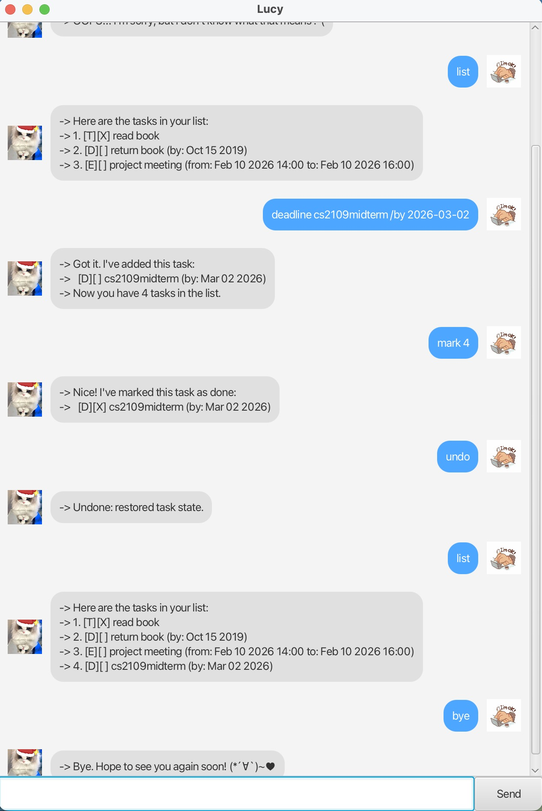

# Lucy User Guide



Lucy is a Java-based task management chatbot that helps you manage tasks efficiently using either a Command Line Interface (CLI) or a JavaFX GUI.

Lucy supports todos, deadlines, events, searching, undo operations, and automatic data storage.

## Adding Todos

Adds a simple task without any date or time.

Example: `todo read book`

```
-> Got it. I've added this task:
-> [T][ ] read book
-> Now you have 1 task in the list.
```

## Adding Deadlines

Adds a task with a due date.

Format:

`deadline <description> /by yyyy-MM-dd`

Example:

`deadline submit report /by 2026-12-02`

```
-> Got it. I've added this task:
-> [D][ ] submit report (by: Dec 02 2026)
-> Now you have 2 tasks in the list.
```

## Adding Events

Adds a task with a start and end date-time.

Format:

`event <description> /from yyyy-MM-dd HHmm /to yyyy-MM-dd HHmm`

Example:

`event team meeting /from 2026-02-10 1400 /to 2026-02-10 1600`

```
-> Got it. I've added this task:
-> [E][ ] team meeting (from: Feb 10 2026 14:00 to: Feb 10 2026 16:00)
-> Now you have 3 tasks in the list.
```

## Listing Tasks

Displays all tasks currently stored.

Example: `list`

```
-> Here are the tasks in your list:
-> 1. [T][ ] read book
-> 2. [D][ ] submit report (by: Dec 02 2026)
-> 3. [E][ ] team meeting (from: Feb 10 2026 14:00 to: Feb 10 2026 16:00)
```

## Marking a Task

Marks a task as completed.

Example: `mark 1`

```
-> Nice! I've marked this task as done:
-> [T][X] read book
```

## Unmarking a Task

Marks a task as not completed.

Example: `unmark 1`

```
-> OK, I've marked this task as not done yet:
-> [T][ ] read book
```

## Deleting a Task

Removes a task from the list.

Example: `delete 2`

```
-> Noted. I've removed this task:
-> [D][ ] submit report (by: Dec 02 2026)
-> Now you have 2 tasks in the list.
```

## Finding Tasks

Searches for tasks containing a keyword.

Example: `find book`

```
-> Here are the matching tasks in your list:
-> 1. [T][X] read book
```

## Undo

Reverts the most recent undoable command.

Example: `undo`

```
-> Undone: removed task
-> [T][ ] read book
```

## Saving Data

Lucy automatically saves tasks to:

`data/lucy.txt`

## Exit

To close Lucy:

`bye`

Enjoy using Lucy! 😊
